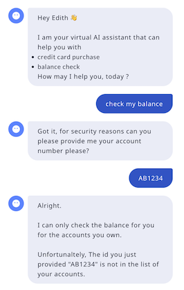
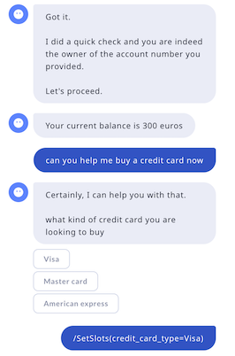
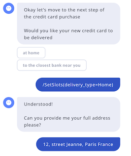
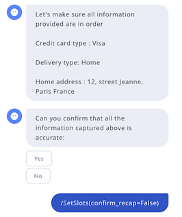
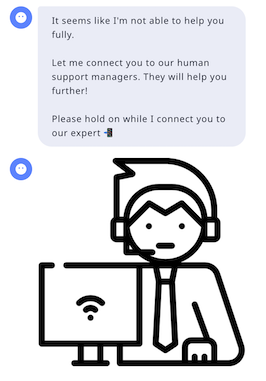

# CSE technical interview

The technical interview will contain two parts
1. Take home exercise
2. Live debugging of a customer bot

## Take home exercise
- A bot is already built and some additional functionalities are needed (Rasa version to install is 3.11.4)
    - in the credentials file you can find two models, feel free to use either one
        - one model fine tuned by Rasa `rasa/cmd_gen_codellama_13b_calm_demo`
        - gpt-4 (if you have access)

- Create a public repository and add the current bot to it.
- `Train` the assistant and run `rasa inspect` to talk to it. This will help you understand its current functionalities.
- Do not hesitate to run the end-to-end test cases with `rasa test e2e tests/e2e_test_cases -o` (add the environment variable `RASA_PRO_BETA_E2E_ASSERTIONS=true`)
- The goal is that the conversation below will work after your changes. You will be presenting this conversation in `rasa inspect` view with the interviewer. The bot responses *must be identical* to the conversation captured in the screen shots below 
- The changes required could include:
    - add new flows
    - adjust existing functionalities
    - customise patterns
    - adjust the prompt
    - create custom actions ...

  
  
  
  

## Extra step
After building the above.
Take some time to think of ways we can improve the current implementation to make it fit a real use case in Customer bot.
Write your ideas down (no implementation is required for this step) and share it during the interview.
